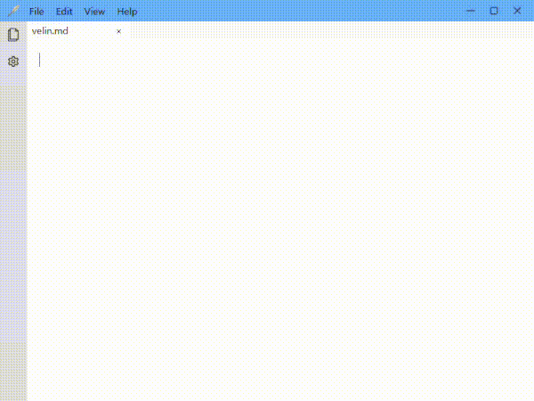

## Instroduction

A Markdown editor with a WYSIWYG interface based on the Milkdown library.

## Note

This is still a beta version.  
  
- The file tree system has not been sufficiently tested.  
- Auto-saving is not implemented, so if the power goes out, your work may be lost.  
- The find/replace feature only works within the currently opened file, not across the entire file tree.  
- Only one theme and font available.  
- Opening a new directory will destroy the previous session.
- Runs only on Windows OS.

## Installation

1. **Download** the latest version of `velin-1.0.0 Setup.exe` from the [release page](https://github.com/hn250424/velin/releases/latest)  
2. **Run** the installer — the executable is created and launched automatically.  
3. **Uninstall** easily through the Control Panel whenever you want.