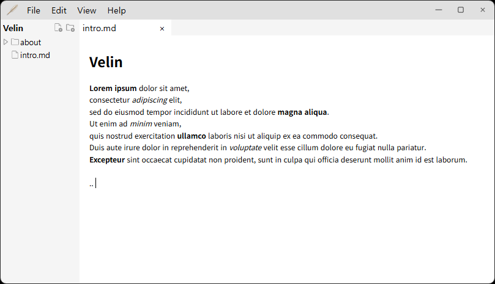

## Instroduction

A Markdown editor with a WYSIWYG interface based on the Milkdown library.

## Note

- This program is currently in beta testing.
- Auto-saving is not implemented.
- Only one theme available.
- Currently runs only on Windows 10/11 (64-bit).

## Donwloads

**Download** the latest version from the [release page](https://github.com/taren250424/velin/releases/latest)

## Site

https://taren250424.github.io/velin/
