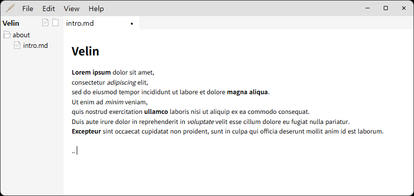

## Instroduction

A Markdown editor with a WYSIWYG interface based on the Milkdown library.

## Note

- This program is currently in beta testing.
- Auto-saving is not implemented.
- Only one theme and font available.
- Currently runs only on Windows 10/11 (64-bit).

## Download

**Download** the latest version from the [release page](https://github.com/hn250424/velin/releases/latest)
